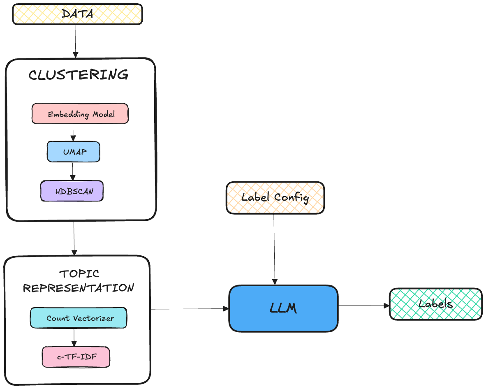

# UNSUPERVISED LABELLING
Labelling huge amount of data is a tedious task. This project aims to automate the process of labelling multi-class classification data using LLMs.


* The raw data is sent for clustering
* Embedding model converts each data point into vector
* UMAP is used for dimensionality reduction
* HDBSCAN is used for clustering
* Count vectorizer and c-TF-IDF are used for topic modeling which is part of BERTopic
* The topics generated are send to LLM for labelling
* The labelling is divided into two stages
    * Good Quality Data
        * The data is labelled as good quality based on Bertopic topic and confidence probability
        * The topics from Bertopic are sent to LLM for labelling
    * Poor Quality Data
        * The data is labelled as poor quality(which has topic -1 and confidence probability below threshold)
        * KeyBert is used for topic extraction
        * The topics from KeyBert are sent to LLM for labelling
* The labelled data is collated and saved

-----------------

## SETUP
```bash
curl -LsSf https://astral.sh/uv/install.sh | sh

uv sync
```
### ENVIRONMENT VARIABLES
```dotenv
AZURE_OPENAI_BASE=https://your-resource-name.openai.azure.com
AZURE_OPENAI_API_KEY=your-api-key
AZURE_OPENAI_VERSION=2023-05-15
AZURE_OPENAI_MODEL=gpt-35-turbo
```
NOTE: LLM could be replaced with any other LLM, this setup uses Azure OpenAI

-----------------
## CONFIGURATION
In main.py, the configuration is stored in a dictionary. This config is used to train the topic model. 
```python
train_config = {
    "dataset": "SetFit/bbc-news",
    "data_cache_dir": "data/input",
    "data_col_name": "text",
    "embedding_model": "thenlper/gte-small",
    "embedding_model_cache_folder": "models/embedding_models",
    "topic_model_dir": "models/topic_models",
    "hash_key": "your_hash_key"
}
```
In main,py, the labelling config is stored in a dictionary. This config is sent to LLM for labelling.
```python
label_config = {
    "business": "any business related topic",
    "entertainment": "any entertainment related topic",
    "health": "any health related topic",
    "science": "any science related topic",
    "sports": "any sports related topic",
    "technology": "any technology related topic"
}
```

-----------------
## RUNNING
To run the project, run the following command:
```bash
uv run main.py
```

-----------------
## OUTPUT
The output is stored in the data/output folder. A hash key is generated for each run and the output is stored in a folder with the hash key. The output folder contains the following files:
* train_config.json
* label_config.json
* final_labelled_data.csv
* labelled_data_confident.json
* labelled_data_non_confident.json

The final_labelled_data.csv contains the labelled data along with the ID of the data point. The labelled_data_confident.json and labelled_data_non_confident.json contains the labelled data for good and poor quality data respectively.
The trained topic model is stored in the models/topic_models folder with the name trained_model_{hash_key}.