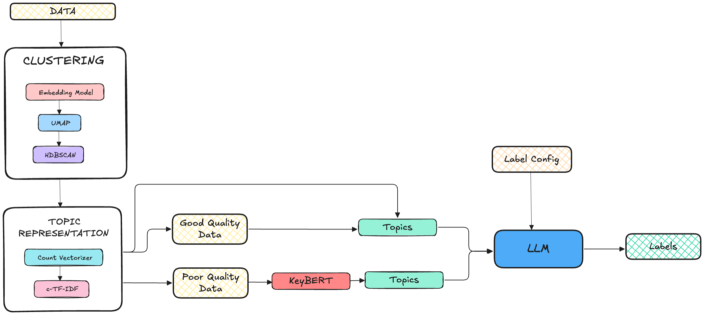

# 📚 UNSUPERVISED LABELLING
Labelling huge amount of data is a tedious task. This project aims to automate the process of labelling binary/multi-class classification data using topic modeling and Large Langauge Model(LLM). The motivation is that LLMs have been proven to be good at labelling data 
but sending huge amount of data for labelling is a costly approach, so instead all data points are clustered and topic are derived from the clustered data points. Then these topics are used for identifying labels which significantly reduces the cost of labelling.


* The raw data is sent for clustering
* **Embedding model** converts each data point into vector
* **UMAP** is used for dimensionality reduction
* **HDBSCAN** is used for clustering
* **Count vectorizer** and **c-TF-IDF** are used for topic modeling which is part of **BERTopic**
* The topics generated are send to LLM for labelling
* The labelling is divided into two stages
    * Good Quality Data
        * The data is labelled as good quality based on **BERTopic**'s topic and confidence probability
        * The topics from BERTopic are sent to LLM for labelling
    * Poor Quality Data
        * The data is labelled as poor quality(which has topic -1 and confidence probability below threshold)
        * **KeyBert** is used for topic extraction
        * The topics from KeyBert are sent to **LLM** for labelling
* The labelled data is collated and saved

-----------------

## SETUP
```bash
curl -LsSf https://astral.sh/uv/install.sh | sh

uv sync
```
### ENVIRONMENT VARIABLES
```dotenv
AZURE_OPENAI_BASE=https://your-resource-name.openai.azure.com
AZURE_OPENAI_API_KEY=your-api-key
AZURE_OPENAI_VERSION=2023-05-15
AZURE_OPENAI_MODEL=gpt-4o-mini
```
NOTE: LLM could be replaced with any other LLM(of course with some code changes), this setup uses Azure OpenAI

-----------------
## CONFIGURATION
In main.py, the configuration is stored in a dictionary. This config is used to train the topic model. 
```python
train_config = {
        "dataset": "SetFit/bbc-news",
        "data_cache_dir": "data/input",
        "data_col_name": "text",
        "embedding_model": "nomic-ai/modernbert-embed-base",
        "embedding_model_cache_folder": "models/embedding_models",
        "topic_model_dir": "models/topic_models",
        "hash_key": hash_key,
}
```
In main,py, the labelling config is stored in a dictionary. This config is sent to LLM for labelling.
```python
label_config = {
        "business": "any business related topic",
        "entertainment": "any entertainment related topic",
        "politics": "any politics related topic",
        "sport": "any sports related topic",
        "tech": "any technology related topic"
}
```

-----------------
## RUNNING
To run the project, run the following command:
```bash
uv run main.py
```

-----------------
## OUTPUT
The output is stored in the data/output folder. A hash key is generated for each run and the output is stored in a folder with the hash key. The output folder contains the following files:
* train_config.json
* label_config.json
* document_info.csv
* **final_labelled_data.csv**
* good_quality_data.csv
* poor_quality_data.csv
* topic_info.csv
* topic_label_dict.json

The final_labelled_data.csv contains the labels along with true labels. The labelled_data_confident.json and labelled_data_non_confident.json contains the labelled data for good and poor quality data respectively.
The trained topic model is stored in the **models/topic_models** folder with the name **trained_model_{hash_key}**.

-----------------
## EXPERIMENT OBSERVATIONS
* Dataset labelled - 1226 data points
* Number of hits to LLM(approximate) - 132
* LLM hits at any point does not send complete text only extracted topics using topic modelling are sent to LLM which is significantly smaller
* Accuracy - **74.45 %**

-----------------
## DISCLAIMER
* This project was intended to check the above-mentioned way of unsupervised labelling and in no way claims that any labelling could be done with the same level of accuracy.
* As of now I believe that if the quality of extracted topics is good there is a high chance that the labelling quality will be good.
* The quality threshold score should be adjusted based on the dataset and the quality of the topics extracted.

-----------------
## FUTURE WORK
* Intelligent clustering - If clusters could be made based on labels then efficient labelling could be done(with additional steps)
* Better topic modelling - The topic modelling could be improved by extracting targeted topics.